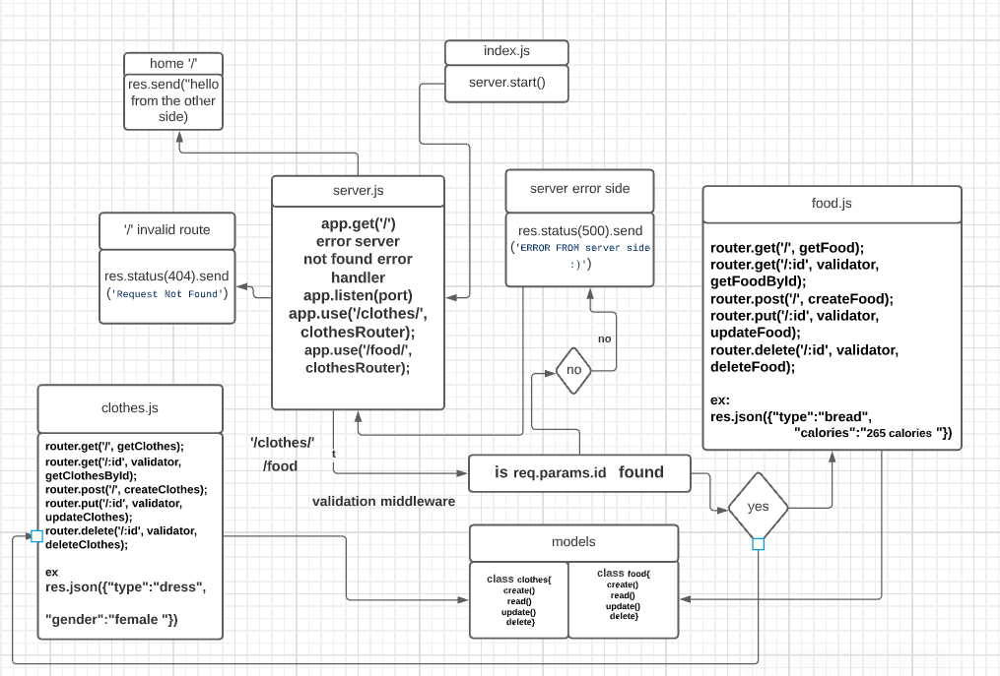

# basic-api-server

## links:

[heroku link](https://basic-api-server-raghad.herokuapp.com/)

## setup environment

### Install

initialization using npm inint -y  
install libraries like express dotenv   
install devDependencies like jest supertest  
create files tree  

 

### Test

404 on a bad route  
404 on a bad method  
500 if no name in the query string  
200 on Create a record using POST  
200 on Read a list of records using GET  
200 on Read a record using GET  
200 on Update a record using PUT  
200 on Destroy a record using DELETE  

 

 ## UML Diagram

 